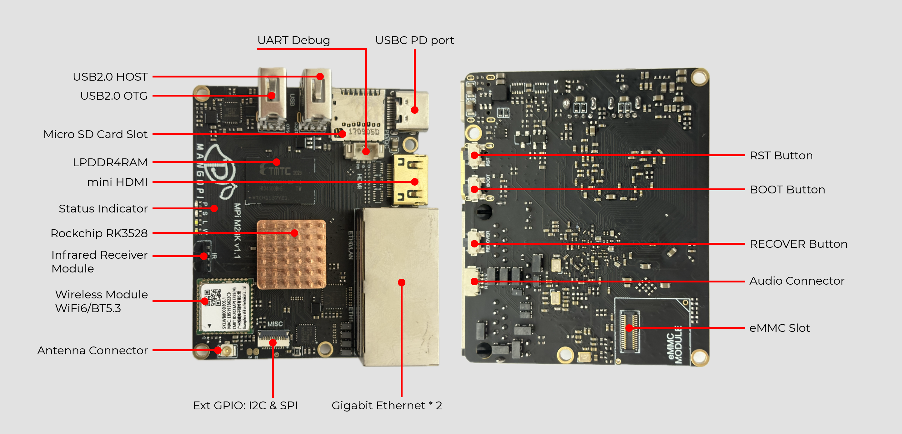
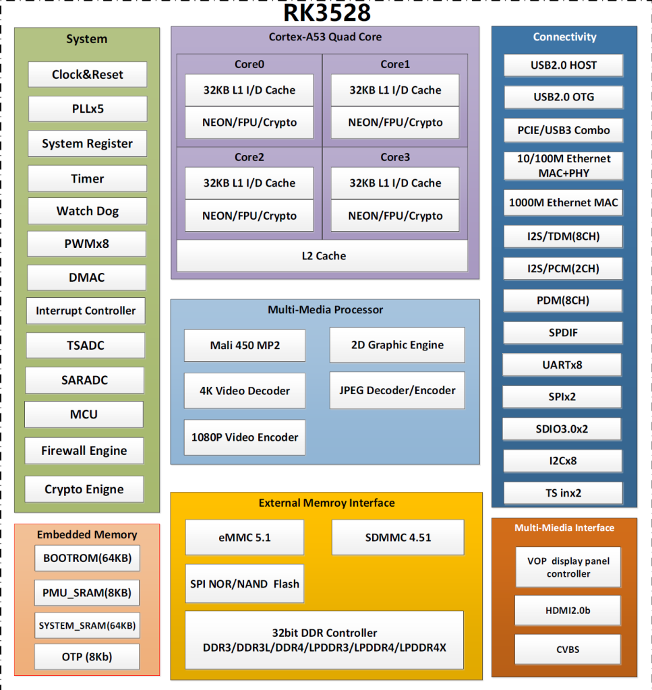

M28K
====

.. include:: ./refs/m28k.ref

产品介绍
--------

- 芒果派 M28K 是一款基于 Rockchip RK3528 开发的一款超小尺寸高性能边缘计网关，外设紧凑，接口丰富。

- 芒果派 M28K 专为包括制造商、物联网开发人员、业余爱好者和 PC DIY 爱好者在内的多元化用户群量身定制，是一个超小尺寸的多功能的平台，可以用于各种不同的应用，包括家庭网络、物联网设备、边缘计算、家庭自动化、教育和娱乐等。

实物图片
--------

芯片框图
--------

特性
----

========= ================
型号       芒果派 M28K
--------- ----------------
SoC       Rockchip RK3528
--------- ----------------
CPU       四核 Cortex-A53
--------- ----------------
GPU       Arm Mali™-450， 支持OpenGL ES 1.1/2.0 和 OpenVG 1.1
--------- ----------------
内存       1/2/4 GB LPDDR4
--------- ----------------
存储       可更换EMMC模块 microSD 存储卡
--------- ----------------
显示       提供 mini HDMI 接口：支持 4K60fps 输出
--------- ----------------
以太网     双千兆以太网
--------- ----------------
无线通讯    Wi-Fi 6 (802.11 b/g/n/ac/ax) BT 5.3 with BLE
--------- ----------------
USB       USB 2.0 Type-A HOST x1 USB 2.0 Type-A OTG x1
--------- ----------------
其他       红外接收器
--------- ----------------
供电       支持PD/QC协商高压供电
--------- ----------------
尺寸      （您没有提供尺寸信息）
========= ================

系统框图
--------

TODO
